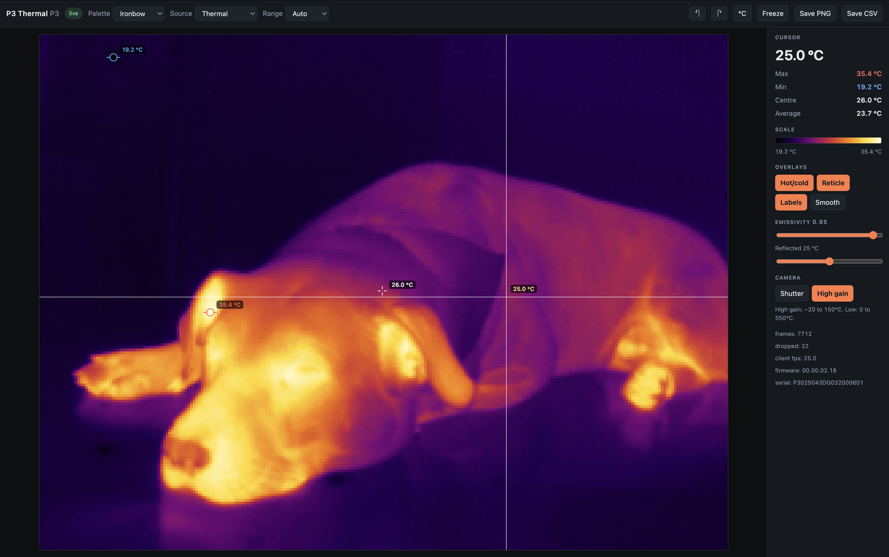

# Thermal Master Viewer

A browser-based viewer for the **Thermal Master P3 / P1** USB thermal camera.

Unofficial, and not affiliated with or endorsed by Thermal Master. Developed
against a P3; the P1 differs only in resolution and should work, but has not
been tested.

Plug the camera in, open **[the viewer](https://ferrolho.github.io/thermal-master-viewer/)**,
click **Connect camera**. No install, no driver, no local server — the page
talks to the camera directly over WebUSB.



## Use it

Use [the hosted viewer](https://ferrolho.github.io/thermal-master-viewer/), or
serve `web/` yourself from anywhere:

```bash
python3 -m http.server -d web 8723       # then open http://localhost:8723
```

WebUSB needs a secure context, and `http://localhost` counts as one. Opening
`index.html` as a `file://` URL will not work — the page is built from ES
modules, which browsers refuse to load over `file://`.

- **Live thermal image** at 25 fps, 256×192 (P3) or 160×120 (P1)
- **Hover** for a per-pixel temperature; live max / min / centre / average
- **7 palettes**; thermal, IR-brightness, or blended view
- **Auto / rolling / manual** temperature range
- **Emissivity** and reflected-temperature correction (Stefan-Boltzmann)
- **Rotate** 90° either way, hot/cold markers, reticle, labels, °C / °F
- **Freeze**, and one-click **PNG** / **CSV** export (the CSV is every pixel's
  temperature in °C, laid out to match what is on screen)
- **Works on a phone** — the panel moves below the image on narrow screens, and
  you read temperatures by dragging a finger across the image
- **Shutter** (NUC) trigger and gain-mode switch
- **Firmware log** in a collapsible footer, recorded from the moment you
  connect so events are already there when you go looking

### Browser and platform support

|                     |                                                                             |
| ------------------- | --------------------------------------------------------------------------- |
| Chrome, Edge, Opera | works                                                                       |
| Firefox, Safari     | no WebUSB, so no                                                            |
| macOS               | works as-is                                                                 |
| Android             | works — plug the camera straight into the phone and open the page           |
| Linux               | needs a udev rule granting access to `3474:45a2`                            |
| Windows             | needs the camera bound to WinUSB, e.g. with [Zadig](https://zadig.akeo.ie/) |

## Why this works

The camera is not a UVC webcam and does not pretend to be one. Its interfaces
are vendor-specific:

```
interface 0 alt 0: class=0xff  ep 0x84 IN bulk, 0x05 OUT bulk   (commands)
interface 1 alt 0: class=0xff  no endpoints                     (idle)
interface 1 alt 1: class=0xff  ep 0x81 IN bulk, 0x02 OUT bulk   (video)
```

WebUSB refuses to claim *protected* interface classes — audio `0x01`, HID
`0x03`, mass storage `0x08`, smart card `0x0B`, video `0x0E`, audio/video
`0x10`, wireless `0xE0`. Class `0xFF` is not among them, so the browser may
claim these interfaces. It is also why no OS driver binds to the camera,
leaving it free.

Some community documentation states the P3 presents `bInterfaceClass=0x0E`.
That is not what this hardware reports. Check for yourself with
`python3 tools/usb-info.py`, or `ioreg`/`lsusb`, before believing either claim.

## Protocol

**Commands** are 18 bytes over a vendor control transfer (`bRequest=0x20`).
`cmd_type` is big-endian; every other field is little-endian, with a
CRC16-CCITT over the first 16 bytes:

```
[0:2] cmd_type (BE)  [2:4] param  [4:6] register
[6:12] zero  [12:14] resp_len  [14:16] zero  [16:18] crc16
```

Read pattern is send → status → response → status; write pattern is send →
status. Streaming needs a specific start sequence with mandatory delays —
without them the camera accepts every command and then sends nothing.

**Frames** are `2 × (2h + 2) × w` bytes between 12-byte start and end markers.
For the P3 that is 197,632 bytes at 25 fps, carrying two sensors:

```
rows 0 .. h-1        IR brightness, 8-bit in the low byte, hardware AGC'd
rows h .. h+1        metadata
rows h+2 .. 2h+2     thermal, 16-bit, in units of 1/64 kelvin
```

So `°C = raw / 64 - 273.15`.

Frames are read in fixed 16 KiB chunks rather than the three sized transfers
the official app uses — those only behave on Linux. Since a frame always ends
with a short 12-byte transfer, that is enough to find the boundary and
resynchronise.

## The firmware log

The status register doubles as a log. Read more than one byte and the current
message appears from about byte 64. A real read looks like this:

```
[337783] I/ffc_svc: ffc b update done\n\r\n\n\r\nal tick: 238\n\r\n 20\n...
\_______________ the live message _______________/ \____ stale tails ____/
```

Only one message is live at a time, and it is written over a buffer that is
never cleared, so everything past its terminator is the remains of older,
longer messages. Reading past that is what produces garbled fragments like
`al tick: 238`. The viewer stops at the first NUL, LF or CR.

Because only one message is live, this is a sampler and not a complete
transcript: the firmware can emit several messages between polls and the
intermediate ones are lost. Lower `POLL_MS` in `web/js/log.js` if you are
hunting something bursty, at the cost of more control transfers competing with
the frame stream.

## Diagnostics

If the browser's device picker shows nothing, this says whether the OS can see
the camera and whether its interfaces are claimable. It is the only Python in
the repository and the viewer does not need it.

```bash
pip install pyusb            # plus libusb: brew install libusb
python3 tools/usb-info.py
```

```
0x3474:0x45a2  P3 (256x192)
  interface 0 alt 0: class=0xff (vendor-specific) subclass=0xf0
      endpoint 0x84 IN  bulk      max=512
      ...
All interfaces are claimable by WebUSB — the viewer should work.
```

## Layout

```
web/index.html       markup
web/styles.css       styles
web/js/usb.js        WebUSB driver: commands, streaming, frame parsing
web/js/viewer.js     state, geometry, rendering, overlay
web/js/ui.js         control wiring, pointer, PNG/CSV export
web/js/log.js        firmware log capture and panel
web/js/text.js       pure helpers for assembling the log
web/js/palettes.js   colour palettes
web/js/download.js   handing a generated file to the browser
web/js/session.js    the camera in use, shared between modules
web/js/main.js       entry point and connection flow
tools/usb-info.py    optional descriptor dump for troubleshooting
tests/               tests for the shipped driver and log helpers
```

Native ES modules, loaded directly by the browser. No bundler, no transpiler,
nothing to install.

## Tests

```bash
node tests/test_webusb.mjs
```

It rebuilds all 11 command buffers from scratch and compares them byte for
byte, CRC included, against buffers captured from the official app. If that
passes, the wire format is right. It also parses a status-register read
captured verbatim from a P3, which is how the firmware log gets read.

## Troubleshooting

**The browser's picker shows no device.** Check the OS sees it at all —
`python3 tools/usb-info.py`, or `lsusb` / `ioreg -p IOUSB -w 0 | grep -i p3`. On
Linux, add a udev rule; on Windows, bind WinUSB with Zadig.

**On macOS, `ioreg` shows the device but nothing can open it.** If it appears
in the `IOUSB` plane but not in `IOService` — marked `!registered, !matched` —
macOS read its descriptors but never published it, and nothing in userspace
can reach it. Unplug for ~10 s and plug it directly into a port, no hub or
extension cable. Try the other port. Reboot if it stays stuck.

**The image looks flat and grey.** That is usually correct: a room is nearly
uniform in temperature. Point it at something warm, or switch the range mode.

**The camera clicks every ~90 seconds.** That is the mechanical shutter doing a
flat-field correction: a blade swings across the sensor to give it a uniform
reference so it can cancel drift. Open the firmware log at the bottom of the
window and you will see `=== Shutter close ===` each time. **Shutter** triggers
one on demand.

## Licence

[Apache-2.0](LICENSE). Chosen over MIT for its explicit patent grant, which is
worth having when implementing an undocumented vendor protocol, and because it
matches `thermal-camera-viewer`, whose published findings this builds on.

## Trademarks

"Thermal Master" is a trademark of its owner. It is used here only to say which
hardware this software talks to. The icon and all artwork in this repository
are original; no vendor logo or branding is reproduced.

## Credit

The protocol was worked out by other people; this is an independent
implementation of their published findings, plus the browser viewer.

- [jvdillon/p3-ir-camera](https://github.com/jvdillon/p3-ir-camera) — original
  captures and protocol notes
- [skywalker1905/thermal-camera-viewer](https://github.com/skywalker1905/thermal-camera-viewer)
  (Apache-2.0) — the frame resync approach, and a full Qt desktop app
- [xaionaro-go/thermalmaster](https://github.com/xaionaro-go/thermalmaster) —
  `doc/reverse-engineering.md`, the clearest write-up of the command format
- [Phalphy/OpenP3](https://github.com/Phalphy/OpenP3) (MIT) — minimal Linux viewer

If you want a full desktop application — ROI analysis, image enhancement,
video recording, a Linux virtual webcam — use `thermal-camera-viewer`. It does
far more than this does. This project exists for the one thing it does not:
opening a URL and having the camera work.
